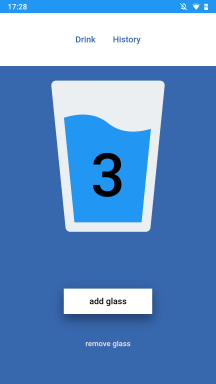

# HydroApp - PWA
🌊 go to [hydroApp](https://sokolx.github.io/hydroapp/)

## What I've used here?
- ▶ Semantic HTML5
- ▶ CSS3 and SASS
- ▶ BEM methodology
- ▶ flex box

## The tools I've used:
- ✔ Visual Studio Code
- ✔ Task runner - GULP
- ✔ Running environment - Node.js and NPM

# How to run local this project? 
`npm install -g gulp-cli`

`npm install`

`gulp`

To publish your page using github pages use `npm run deploy`
